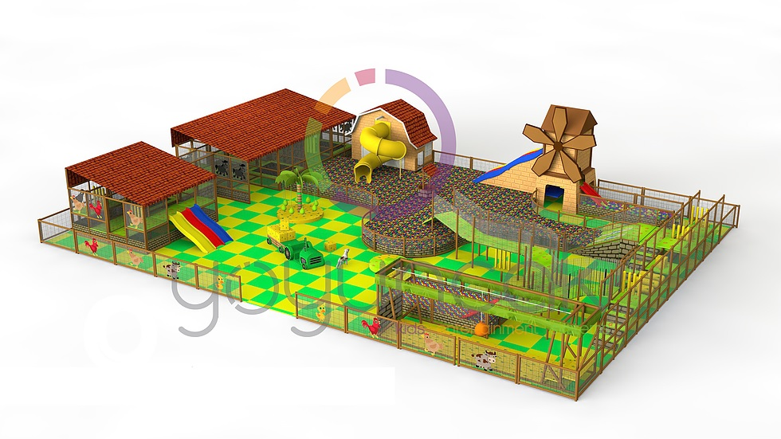
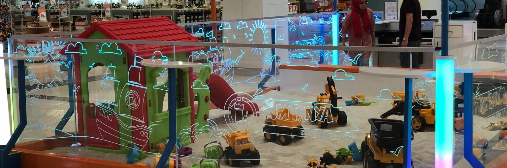
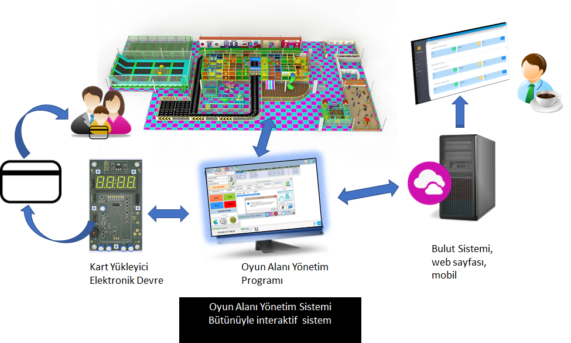
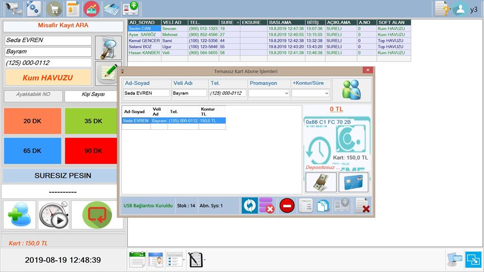
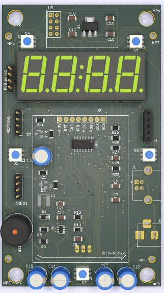
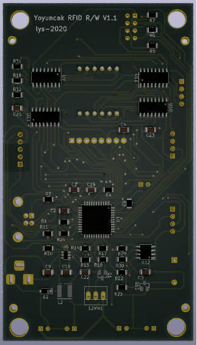
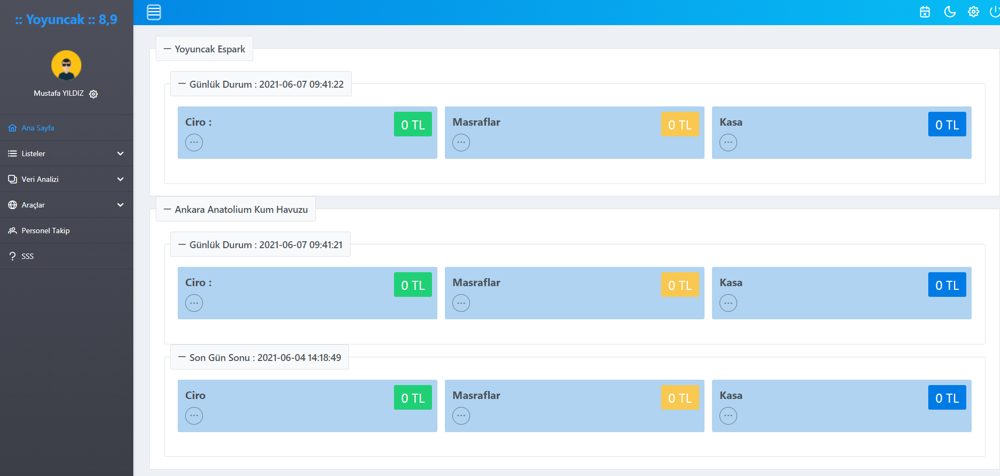

# **Yoyuncak Oyun Alanı Yönetim Sistemi**
# [English Version](#English)

Oyun alanlarına yatırım yapan insanlar gelen müşterilerin eğlenerek güzel vakit geçirmelerini amaçlamaktadır. Bunun için buralarda yetişkinlere ve çocuklara yönelik oyuncaklar ve oyun etkinlikleri bulunmaktadır. 

Oyun alanlarındaki oyuncakları ve oyun etkinliklerini aşağıdaki gibi gruplayabiliriz;

* Soft alanlar: top havuzları, trambolin parkları vb.
* Kum havuzları.
* Jetonlu veya kartlı oyuncaklar:
    1. Ekranlı oyuncaklar.
    2. Kiddie Rides adı verilen çocuk gurubu oyuncaklar.
    3. Air Hokey, langırt vb. oyuncaklar.

Bir oyun alanında yukarıdaki gruplardan bir veya bir kaçı aynı anda bulunurlar. 

Her oyun alanı işletmecisi, işini en verimli ve karlı hale getirmek için bu alana giren müşterilerin ödediği ücretleri, oyun sürelerini, kampanyaları ve çalıştırdığı personeli yönetmek ister. Bu amaçla  da oluşturduğu işletme senaryosunu takip eder, değerlendirir gerekirse de güncellemeler yapar.
Sonuçta işletmeci bu işten para kazanmak için yatırım yapar.

İyi yönetim iyi kazanç getirir.

Resim : Oyun alanı örneği.

Oyun merkezine/alanına gelen müşterilerin geldiği andan itibaren geçirdikleri süreçleri şu şekilde özetleyebiliriz:

1. Müşteri oyun makinesi veya etkinliği seçer.
2. Jeton alır veya karta kontur yükletir.   
3. Eğer oyun makinesini tercih etti ise kartı okutur veya jeton atar.
4. Eğer Top Havuzu veya kum havuzunu vb. seçti ise ;
    * Kalma süresini belirler.
    * Gerekli ücret miktarı için ödeme (Nakit, kredi kartı, jeton, temassız kart vb. ile) yapar. 
    * Görevli süre bitiminde oyun alanından misafiri çıkartmak için ailesi ile iletişime geçer.
  
  
  Resim : Kum havuzu.
  
 Bu senaryo birçok oyun alanında yaklaşık aynıdır.
  
  Günümüz teknolojileri de dikkate alınarak bu basit yaklaşımda bile etkili ve verimli bir yönetim için :
 1. Günlük ve anlık kazanç bilinmeli ve geriye dönük haftalık-aylık-yıllık vb. saklanarak gerektiğinde incelenebilir olmalı. 
 
 2. Günlük veya anlık müşteri sayısı takip edilebilmeli ve kaydedilmeli.
 
 3. İşletme kart kullanıyorsa kullanımdaki kartlar ve stok takip edilebilmeli.
 
 4. İşletmede yapılan kampanyalar vb. ücret sistemine yansıtılmalı ve takip edilebilmeli.
 
 5. İşletmede ürün satışı yapılıyorsa bu ürünlerin satışı ve stok takibi yapılıp kaydedilmeli.
 
 6. Top havuzu ve kum havuzunda müşterilere farklı süre seçenekleri olmalı.

 7. Top havuzu ve kum havuzunda bulunan müşteriler için müşteri takip ve ödeme sistemi olmalı.

 8. Anlık ve günlük olarak hangi oyuncaktan veya oyun etkinliğinden ne kadar kazanıldığı kaydedilmeli ve takibi yapılmalı.

 9. Sistemde yaşanması muhtemel bir takım problemlere (PC bozulması, internet bağlantı arızaları vb.)  karşı alternatif çözümler olmalı.
 
Yukarıda sayılan bütün maddelerde belirtilen konulara işletmeci tarafından web ve mobil  üzerinden anlık ve geriye dönük olarak erişilebilir olmalı. 

Böylece işletmeci anlık-günlük-haftalık-aylık-yıllık vb. durum değerlendirmesi yaparak müşteri ilgi ve alakasına göre süre ve fiyatlandırmada, oyun makinesi değiştirme yada güncelleme, personel sayısı vb. değişikliklere karar verip uygulayabilmelidir.

**Yoyuncak Oyun Alanı Yönetim Sistemi yaklaşımı**, işletmeciye oyun alanının yapısına, örnek veya uygulanmak istenen yönetim senaryosuna göre gerekli tüm bileşenler için çeşitli çözümler sunarak işletmecinin oyun alanını en verimli-kazançlı şekilde kullanabilmesini amaçlar. Sunulan bütün bu çözümler yukarıda açıklanmaya çalışılan maddeleri bütünüyle kapsamaktadır. İşletmecinin ihtiyacına uygun bileşenler  oyun alanına uygulanır.

## Yoyuncak Oyun Alanı Yönetim Sisteminin Bileşenleri

Yukarıda yaptığımız analizdeki şartları sağlamak amacıyla sistemimiz aşağıdaki öğelerden oluşmaktadır.

* Oyun alanı yönetim programı.
* Kartlı sistem jeton kanalı yükleme cihazı. (Kablosuz haberleşme ve IOT  arge de).
* Kartlı sistem jeton kanalları (Kablosuz haberleşme ve IOT arge de).
* Bulut sistemi (Web ve mobil ).

<small>*( Geliştirme işlemi devam ediyor …)*</small>
* Self servis temassız kart verme ve yükleme otomatı.
* Mobil ödeme-çalıştırma sistemi.

Resim : Etkileşimli oyun alanı.

### Oyun alanı yönetim programı ile yapabilecekleriniz:
###

Resim: Oyun alanı yönetim programı ana ekranı.

1. Kartlı sistemlerde kartı şifreleme-kontur yükleme ve web- yerel veri tabanına kaydetme. Kart bilgisini görme. Ayar kartları oluşturma.
2. Kart stok takibi. Mevcut durumun web-yerel veri tabanına kaydetme.
3. Gün sonunda veya kasiyer değişimlerinde gün sonu veya kasa devretme işlemi yapma ve web-yerel veri tabanına kaydetme.
4. Ürün satışı, stok takibi. Mevcut durumun web -yerel veri tabanına kaydedilmesi.
5. Yönetici ve kasiyer olarak yetkilendirilmiş şifreli girişlerin olması. İstenilen sayıda kasiyer ekleyebilme.
6. Kasiyerlerin programa giriş ve çıkışlarının takibini yapabilme.
7. Havuzdaki (Kum-top) müşterileri zamanı olarak takip etme açısından çeşitli listeleri (iptal, süreli, süresiz, günlük vb) gösterme.
8. Kum havuzu ve top havuzlarındaki müşterilerin takip edilmesi;
    * Havuzdaki müşterilerin ilk girişte kaydını alma, web-yerel veri tabanına kaydetme.
    * Etiket kâğıdına misafir başlama ve bitiş zamanlarını yazdırarak bir tanesini misafirin sırtına yapıştırma diğerini de müşteriye verme. (Misafir güvenliği ve takip için)
    * Müşterinin farklı kalma sürelerini belirleyebilme ve bunları fiyatlandırma.
    * Seçilen süreyle ilgili ücreti, nakit, kredi kartı ve temassız karttan tahsil edebilme.
    * İçerde bulunan anlık günlük müşteri sayısını gösterme web-yerel veri tabanına kaydetme.
    * Aynı anda kum havuzu ve top havuzunda bulunan müşterileri ayrı ayrı takip etme.
    * Müşterilerin süresi bitmeden 5dk öncesinde kasiyere haber verme. 
    * Müşterilere izin verme (tuvalet, yemek vb.) işlemlerinde süreyi dondurma.
    * Müşterileri havuz dışına alma.
    * İsme göre müşteri arama.
    * Ayakkabılık varsa müşteri ayakkabı no takibi yapma.
    * İptal işlemi uygulayabilme. İptal işleminden sonra temassız karta iptal edilen kontürün geri yüklenmesi.
    * Promasyon ve kampanya takibi yapabilme.
    * Çeşitli indirim seçenekleri uygulayabilme( kardeş indirimi vb.).
    * Belirlenen süre tarifeleri arasında geçiş yapma veya müşteriye ek süre (belirlenen tarifeler kadar) verebilme. İndirim alan misafire süre geçişlerinde de indirim uygulama.
    * Misafir bilgi güncelleme yapma.
    * Hızlı grup misafir kaydı yapma.
9. Top ve kum havuzları için abonelik oluşturma ve gelen abonelerin ödemelerini temassız karttan alabilme.
###
Resim : Kum-top  havuzu abone işlemleri.

10. Farklı çalışma modları:

    Program bu çalışma modları ile bir oyun alanında farklı noktalarda farklı işlevleri gerçekleştirip raporlayabilmektedir. Örneğin Oyun alanının girişinde satış modunda temassız karta kontür yükleyip ürün satılmasını sağlarken top havuzu veya kum havuzunun ya da müşterinin süreli takibinin yapılması gereken herhangi bir noktada takip modunda çalışmaktadır.
    
    * Satış Çalışma Modu : Program sadece kart yükleme ve ürün satışı işlemlerini gerçekleştirir. Gün sonunda ciro buradan hesaplanır.
    * Takip Çalışma Modu : Programı sadece kum ve top havuzunun takibini yapar.
    * Satış-Takip Çalışma Modu : Program hem satış hem de takip yapar
11. Kartlara ait varsa yada kullanılmak isteniyorsa deposito bilgilerini takip eder.
12. Her bir karttın anlık olarak kullanım bilgisini gösterebilir. 
13. Veri toplama kartı ile her oyuncaktan istenilen peryotta bilgi toplama ve kaydetme.

<small>*( Geliştirme işlemi devam ediyor …..)*</small>

14. Kartlı sistem jeton kanalı programlama cihazına kablosuz olarak gelen oyun makinelerine ait bilgileri alır web-yerel veri tabanına kaydeder.
15. Her oyun makinesinin kablosuz ağdaki durumunu gösterme ve oyun makinelerindeki jeton kanallarına ait çeşitli ayarları yapma

### Kartlı Sistem Jeton Kanalı Yükleme Cihazı Özellikleri :
###

Resim : Yükleme cihazı PCB görünümü.

1. Mikrodenetleyici tabanlı gömülü sistem mimarisine göre dizayn edilmiş tasarım..
2. MIFARE kartları şifreleme, kontur yükleme, okuma, silme işlemlerini yapma.
3. PC den bağımsız olarak çalışma. (Dokunmatik ekran programlama paneli ile. İsteğe bağlı olarak ayrıca yapılır.)
4. PC ye tak-kullan olarak bağlanma (Sürücü kurmak gerekmez).
5. Sesli ve ışıklı durum göstergeleri.

<small>*( Geliştirme işlemi devam ediyor …..)*</small>

6. Kablosuz jeton kanallarıyla birlikte bir kablosuz ağ oluşturma ve ağı yönetebilme. Kablosuz jeton kanallarından gelen bilgileri web-yerel veri tabanına kaydedilmek üzere PC ye gönderme.
7. Oyun makinelerinin çeşitli ayarlarını kablosuz olarak gerçekleştirme.
8. Web üzerinden erişilebilir olmak.

### Kartlı Sistem Jeton Kanalı Özellikleri :
1. Mikrodenetleyici tabanlı gömülü sistem mimarisine göre dizayn edilmiş tasarım.
2. Şifrelemesine uygun MIFARE kartları okuyabilme. Kontur miktarını düşüp karta tekrar geri yükleme ve son durumu gösterme.
3. Işıklı se sesli uyarı.
4. Ayar kartlarıyla ayarları değiştirilebilir olma.
5. 	Klasik jeton kanalları yerine kolayca monte edilme.

<small>*( Geliştirme işlemi devam ediyor …..)*</small>

6. Kablosuz olarak verileri ana makineye gönderme.
7. Kablosuz olarak gelen ayar bilgilerini alma ve uygulama.

### Bulut Sistemi (Web ve mobil ) Özellikleri :
###
Resim : Bulut sisteminde bulunan web sayfası anlık ve son gun sonu görünümü.

1. Günlük ve anlık müşteri sayısını, ciroyu vb.  takip edebilme.
2. Günsonu işlemlerini görme.
3. Kasiyer girişlerini takip etme.
4. Farklı raporlama seçenekleri.
5. Süre ve fiyatları güncelleme.
6. İşletmecinin oyun alanı hakkında çeşitli verilerin analizlerini yapabilmesini sağlama.
 
Yukarıda anlatılan bütün bu çözüm yaklaşımlarının yanında işletmecinin isteğine göre oyun alanının yapısına uygun farklı çözümler de geliştirilerek işletmeciye sunulabilmektedir.

 08.06.2021 YOYUNCAK ARGE ve DANIŞMANLIK  

### English
## YOYUNCAK Playground Management System 

People investing in playgrounds aim to have their customers have a good time while having fun. For this, there are toys and game activities for adults and children.

We can group the toys and game activities in the playgrounds as follows;
* Soft areas: ball pools, trampoline parks, etc.
* Sandboxes.
* Toys with coins or cards:
    1. Display toys.
    2. Kids group toys called Kiddie Rides.
    3. Air Hockey, table football, etc. toys.

One or more of the above groups are present in a playground at the same time.

Every playground operator wants to manage the wages, game times, campaigns and staff it employs for customers entering the space in order to make its business most efficient and profitable. For this purpose, it follows the business scenario it has created, evaluates it and makes updates if necessary.
After all, the operator invests to earn money from this business.

    

 Picture : Example of playground. 

 
We can summarize the processes that the customers who come to the game center/area from the moment they arrive:

1. The customer chooses the game machine or activity.
2. It receives coins or loads contours to the contactless card.
3. If she/he prefers the game machine, she makes the game machine read the card or throw a coin.
4. If you use Ball Pool or sandbox etc. has chosen;         
    * Sets the residence time.
    * Pays (by cash, credit card, token, contactless card, etc.) for the required fee amount.
    * At the end of the time, the officer contacts her/his family to remove the guest from the playground.
  

    

 Picture : Example of Sandbox.. 

This scenario is about the same in many playgrounds.

    
    Considering today's technologies, even in this simple approach, for an effective and efficient management:

1. Daily and instant earnings should be known and retrospective weekly-monthly-yearly etc. should be stored and viewed when necessary.
2. The number of daily or instant customers should be tracked and recorded.
3. If the business uses contactless cards, the cards in use and stock should be tracked.
4. Campaigns etc. should be reflected in the wage system and be followed.
5. If products are sold in the business, the sales and stocks of these products should be tracked and recorded.
6. In the ball pool and sandbox, customers should have different time options.
7. There should be a customer tracking and payment system for customers in the ball pool and sandbox.
8. It should be recorded and tracked how much is gained from which toy or game activity on a daily and instantaneous basis.
9. There should be alternative solutions against a number of possible problems in the system (PC breakdown, internet connection failures, etc.).

The business owner should be able to access the transactions specified and recorded in all the above-mentioned articles instantly and retrospectively over the web and mobile.

Thus, the business owner can evaluate the situation instantly-daily-weekly-monthly-yearly, etc., according to customer interest and relevance, time and pricing, changing or updating the game machine, number of personnel, etc. can decide and be able to apply changes to the playing field.

    
    <strong>Yoyuncak Playground Management System approach </strong> aims to enable the owner of the playground to use the playground in the most efficient and profitable way by providing various solutions for all necessary components according to the structure of the playground and the management scenario to be applied.
    All these solutions presented aim to fully cover the issues discussed above. Components suitable for the needs of the business owner are applied to the playground.

## Components of YOYUNCAK Playground Management System
In order to meet the conditions in the analysis we made above, our system consists of the following elements
* Playground management software.
* Contactless card electronic coin channel and loading device. (Wireless communication and IoT continue to be developed.).
* Cloud systems and Dashboard (Web and mobile).

<small>*( Development continues…)*</small>
* Self-service contactless card issuing and loading machine.
* Mobile payment and run system.

    

 Picture : Interactive playground... 

 

### What you can do with the playground management program:
 

    

 
    Picture : Playground management program main screen. 

 

1. Encrypting the card in contactless card systems, uploading the contour and saving it to the web-local database. View card information and  creating setting cards.
2. Card stock tracking. Saving the current state to the web-local database.
3. Performing end of day transaction or cashier transfer transaction and saving in web-local database.
4. Product sales and stock tracking. Saving the current state in the web-local database.
5. Ability to login with manager and cashier passwords and add cashiers as desired.
6. To be able to follow the cashiers' entry and exit from the program.
7. Showing various lists (cancellation, timed, indefinite, daily, etc.) in the sand/ball pool to keep track of customers in time.
8. Follow-up of customers in sandboxes and ball pools:
    * Registration of customers in the pool at the first login, registration in the web-local database.
    * Printing guest start and end times on label paper. (For guest security and follow-up)
    * Identifying and pricing different customer lengths of playing time.
    * Ability to collect the fee for the selected playing time from cash, credit card and contactless card.
    * Showing the number of instant daily customers inside, saving to web-local database.
    * Tracking the customers who are in the sandbox and ball pool at the same time separately.
    * Ability to notify the cashier 5 minutes before customers expire.
    * Freezing the time in the processes of allowing customers (toilet, meal, etc.).
    * Ability to remove customers from the pool.
    * Customer search by name.
    * Ability to follow the customer's shoe number if there is a shoe rack.
    * Ability to apply cancellation operation and restoring the canceled contour to the contactless card after cancellation.
    * Ability to follow promotions and campaigns.
    * Ability to apply various discount options and campaigns (sibling discount, etc.).
    * Ability to switch between determined time tariffs or to give additional time to the customer (up to the determined tariffs). 
    The ability to apply a discount to the customer who receives a discount, even when switching between time tariffs.
    * Ability to update guest information.
    * Quick group guest registration.
9. Creating subscriptions for ball pool and sandboxes and receiving payments from incoming subscribers via contactless cards.

    

 
    Picture : Sand and ball pool subscription transactions.

10. Different operating modes:

With these operating modes, the program can perform and report different functions at different points in a playground.  For example, at the entrance of the playground, it can load contours on the contactless card in sales mode and sell products. It works in tracking mode at any point where timely tracking of the ball pool or sandbox or the customer is required.
   
* Sales Operation Mode: The program only performs card loading and product sales. Turnover is calculated from here at the end of the day.

* Tracking Mode : The program only tracks the sand and ball pool.
* Sales-Follow-up Mode: The program performs both sales and follow-up.
11. It follows the deposit information if the cards belong to them or if they are wanted to be used.
12. It can show instant usage information of each card.
13. Collecting and recording information from each toy in the desired period with the data collection card.

<small>*( Development continues…)*</small>

14. The contactless card system receives the information of the game machines coming wirelessly to the electronic contour loading device and saves it in the web-local database.
15. Showing the status of each gaming machine in the wireless network and making various settings of the coin channels on the gaming machines.

## Contactless Card System Electronic Coin Loading Device Features

    
     

 
    Picture : Contactless card system electronic coin channel loading device PCB view.

 

1. Design based on microcontroller based embedded system architecture.
2. Encrypting, top-up, reading, deleting MIFARE cards.
3. Working independently from PC. (With the touch screen programming panel. It is optionally made separately.)
4. Connecting to PC as plug-and-play (no driver installation required).
5. Audible and light status indicators.

<small>*( Development continues…)*</small>

6. Creating and managing a wireless network. Sending information from wireless electronic coin devices to PC for saving in web-local database.
7. Performing various settings of gaming machines wirelessly.
8. Being accessible via the web.

## Contactless Card System Electronic Coin Device Features

1. Design based on microcontroller based embedded system architecture.
2. Ability to read MIFARE cards . Can receive payments from eligible contactless cards.
3. Audible and light status indicators.
4. Settings can be changed with setting cards.
5. Easy to install instead of conventional coin devices.

<small>*( Development continues…)*</small>

6. Wirelessly sending data to the host.
7. Receiving and applying settings information wirelessly.
8. Being accessible via the web.

## Cloud System (Web and mobile) Features:

    

 
    Picture : Instant and end-of-day view of the web page (dashboard) in the cloud system.

 

1. Ability to track data such as daily and instantaneous number of customers and turnover over the web.
2. See end of day transactions.
3. Keeping track of cashier entries.
4. Different reporting options and graphical representation.
5. Update times and prices.
6. Ability to enable the business owner to analyze various data related to the playground.

    
    08.06.2021 YOYUNCAK R&D and CONSULTANCY

